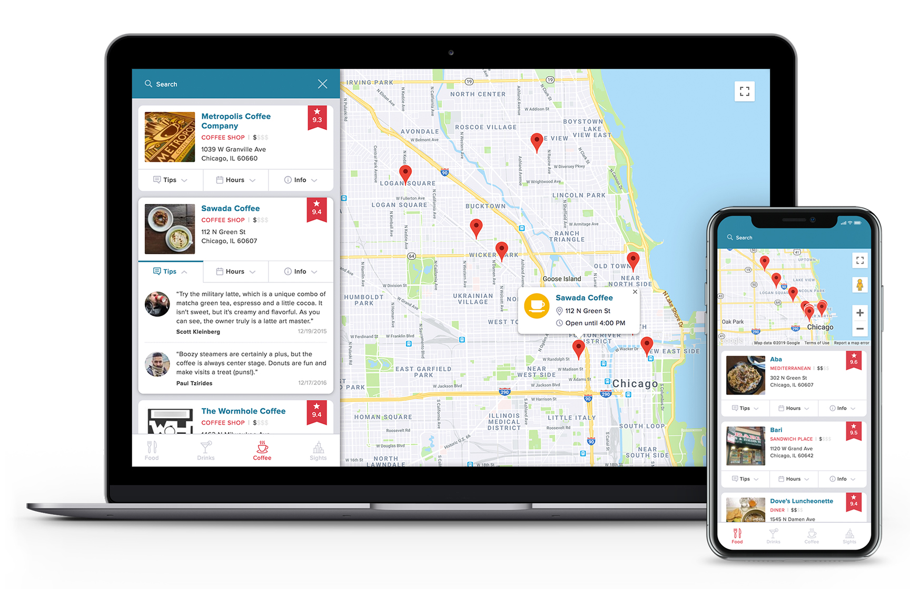

# Project Overview

Check out **The Loop: Chicago City Guide** for the best restaurants, bars, coffeehouses and attractions in the windy city!

Visit the [live version](https://mattrdiamond.github.io/the-loop-city-guide/), or follow the running instructions below to run locally.

## Details

- This single page application fetches venue recommendations from the Foursquare API and integrates Google Maps to display each venue's location.
- Clicking a venue on the sidebar will animate its associated map marker and open an info window.
- Each venue includes expandable tabs with additional info including tips, hours and venue information.
- The venues can be filtered using the search function at the top of the sidebar. As you type, the map will zoom in on the matching locations. If your search returns a single location, the info window will automatically be displayed.
- Clicking on the map will close the sidebar on smaller screen sizes and mobile devices.
- The sidebar can be accessed using the keyboard by pressing enter on the navigation menu. You can then tab through the museum names and press enter to display the info window.

## Running Instructions

### Development Mode

- Download or Clone the Repository.
- Install all project dependencies with `npm install`
- Start the server with `npm start`
- A new browser window open automatically displaying the app. If it doesn't, navigate to [http://localhost:3000/](http://localhost:3000/) in your browser.

### Production Mode

- To create a production build use `npm run build`
- Navigate to the build directory and start the server with `npm run deploy`
- **Note:** _The service worker for this app will only cache the site when it is in production mode._

### Create React App

This project was bootstrapped with [Create React App](https://github.com/facebookincubator/create-react-app).
